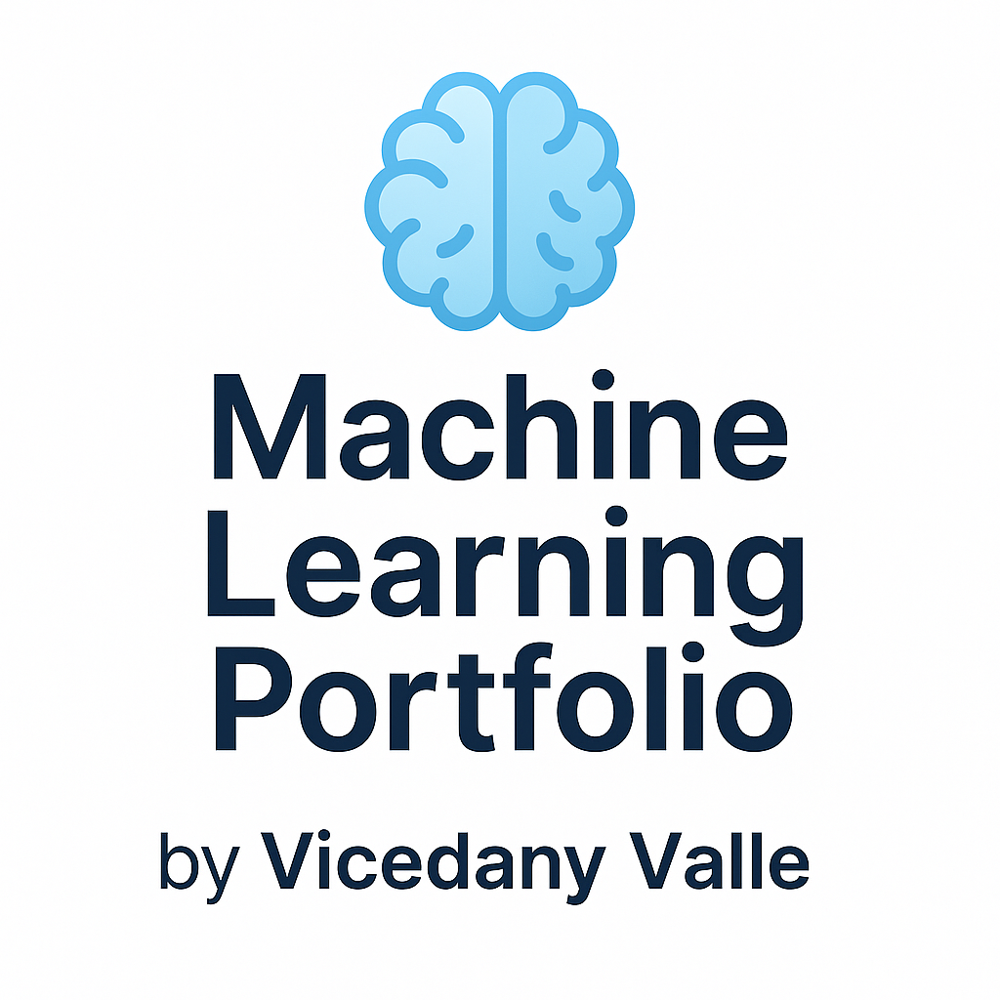

  

🧠 Machine Learning Portfolio
Welcome! This repository showcases my Machine Learning journey (July–Dec 2025) — from fundamentals to full-stack projects, deep learning, and NLP.
🚀 Highlights
Core ML Skills: Python, NumPy, Pandas, scikit-learn, TensorFlow/PyTorch
Specialties: Supervised ML, Recommender Systems, Computer Vision, NLP
Full-Stack: Flask/Django, PostgreSQL, deployment on Render/Heroku
Projects:
🧪 Titanic Survival Predictor – EDA + classification
🧠 Iris/Wine Classifier – model training & evaluation
🎬 Movie Recommender System – ML + Flask + PostgreSQL
🖼️ Image Classifier – CNNs on MNIST/CIFAR
🗣️ Tweet Sentiment Analyzer – NLP with embeddings
🔥 Capstone Project – specialization (Vision/NLP/LLM)
